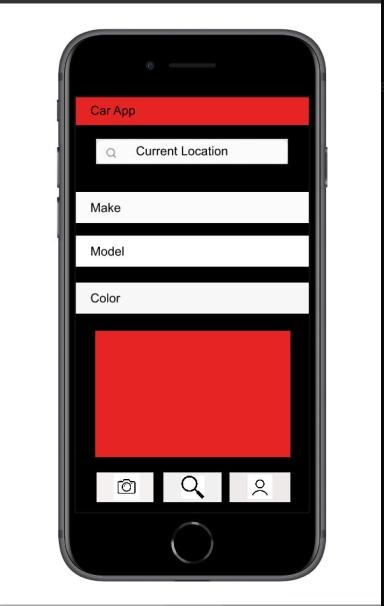
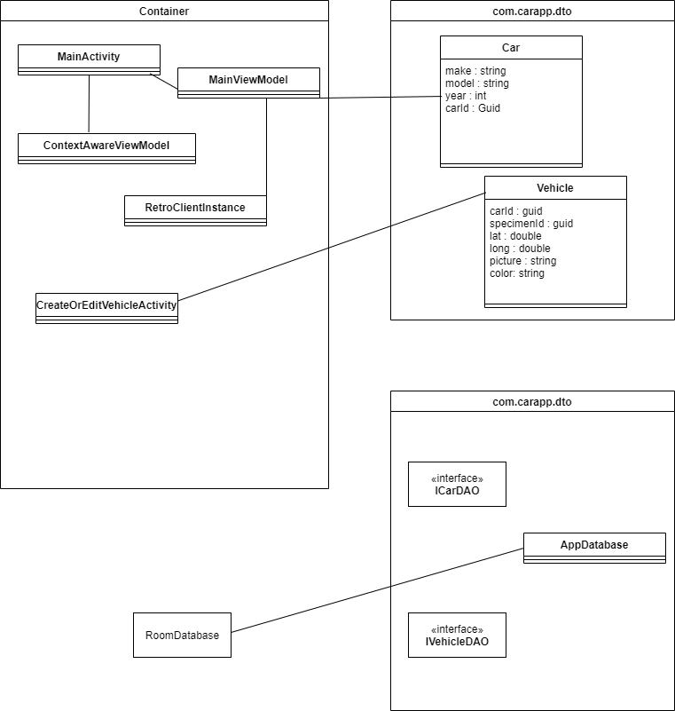

# car-app
---
Design Document 
Team: Yoshua Meatchem, Reid Sweeney, Rohan Patel, Abhishek Goel, Eric Miller

## Introduction
---
Have you ever wanted to look at exotic cars in your area? Do you know the last time you saw a car and thought “Wow, you do not see that car every day!”. Car-App can help you:  

•    Upload images of exotic/project cars in your area.  

•    List Details of make, model, and color.  

•    Record the location of the car/car meet.     

Use your Android device to help discover the different types of cars in your area. Take photos with the on-device camera and GPS location to locate the car. Create many posts about exotic and project cars and learn more about them.

## Storyboard
---

[Car App Storyboard](https://projects.invisionapp.com/freehand/document/fHbLFga4v)  

## Functional Requirements
---

### Requirement 100.0: 
#### Scenario
As a user interested in cars, I want to be able to show all the exotic and project cars in my area, with the make, model, and customizations.

#### Dependencies
Car data is available and accessible

#### Assumptions
Project Cars are featured differently than Exotic/Sports cars

#### Example 

1.1

**Given** Car data is available

**When** I add a car to the map

**Then** I receive/fill the subjects below:
	Make: Audi
	Model: 2018 RS7
	Color: Black
  
1.2

**Given** Car data is available 
	        GPS data is available 
          
**When** I add a new car to the map

**Then** I receive/fill the subjects below:
	Make: Kia
	Model: 2020 Stinger
	Color: Orange
  
**AND** I can upload location of car with minor detail

1.3

**Given** Car data is available 
	        The device has access to a camera and the camera roll. 
	        The device has GPS functionality and has access to use both GPS and Current Location. 

**When** I add a car to the map

**Then** I receive/fill the subjects below:
	Make: Nissan
	Model: Skyline R34 1998
	Color: Blue with White Stripes
	Add Image: Image from Camera Roll

**AND** I can upload location of car with minor detail

**Then** When I navigate to the homescreen/map. I should see the image of a car that was uploaded by user. 

## Class Diagram

### Class Diagram Description
---
- MainActivity:  The first screen the user sees.  This will contain a map with cars, and a button to add a car to map.
- CreateOrEditVehicleDetails: Page where you can create a non-existing vehicle, or edit an existing vehicle..
- RetrofitInstance: Boostrap class required for Retrofit.
- Car: Noun class that represents a car.
- Vehicle: Noun class that represents an instance of a car (vehicle).
- ICarDAO: Interface for Retrofit to find and parse Car JSON.
- IVehicleDAO: Interface for Room to persist Vehicle data.

## Scrum Roles
---
- DevOps: Eric Miller
- Integration Specialists: Reid Sweeney and Yoshua Meatchem 
- UI Secialists: Rohan Patel and Abhishek Goel

## Weekly Meeting 
---
Platform we are meeting on is Discord:  

-Every Monday @2PM  

-Every Friday @11AM

Assignments due ususally on Sundays
